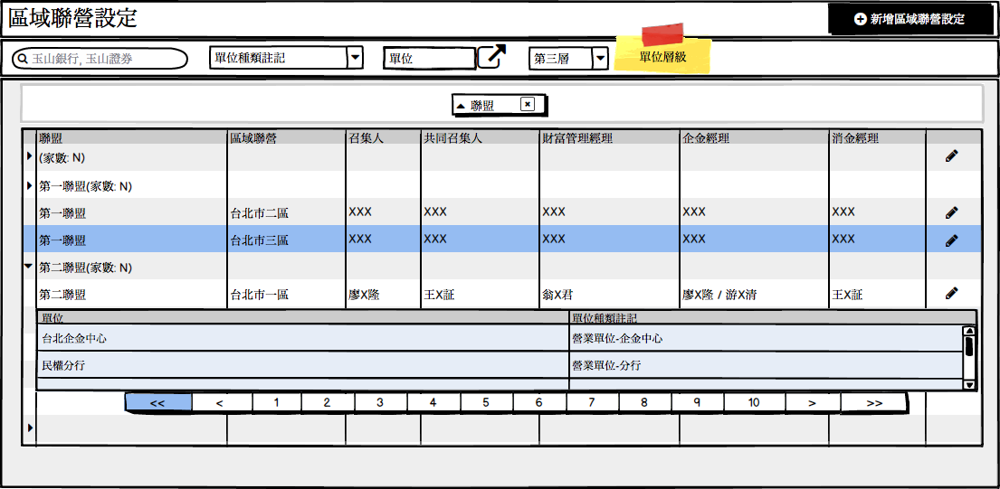
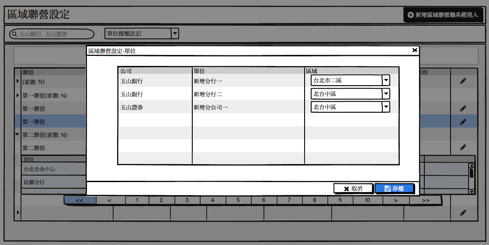
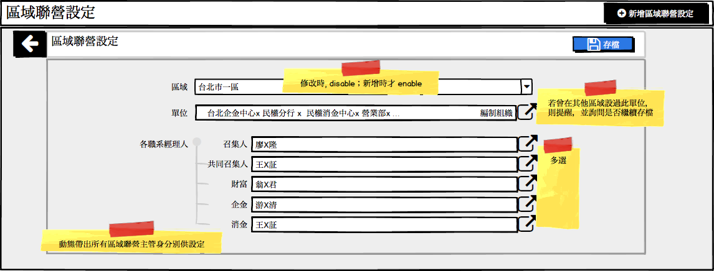

|功能代號|ZZ110101|功能名稱|區域聯營設定|
|--|--|--|--|
|需求編號|REQ010800|||
|使用單位|銀行人資處|使用角色|組織承辦|
### 一. 功能概述：
提供功能設定聯盟、區域聯營及單位的關係，並能記錄每一區域聯營的召集人、副召集人、消金經理、企金經理、財富經理是哪些人。

### 二. 前置作業
無
### 三. 使用案例說明
1. 查詢區域聯營設定(畫面1)
  1. 提供【公司】【單位種類註記】【單位】【單位層級】查詢條件供篩選，僅篩選編制組織中，【單位種類註記】屬於營業單位者。
  2.	【單位層級】保留彈性不做限制，預設查詢「第三層」（現行不需要設定到科組）
  3.	依篩選條件查出的單位，若有未設定區域者，會列在第一筆，並顯示筆 數，可按```編輯```設定各單位的所屬區域(畫面2)。
  4.	欲查看某區域的單位有哪些，可點選第一欄展開，參考(畫面1)台北市一區。
2.	依【聯盟】分群，帶出各區域聯營、各職系的經理人（依【區域聯營主管身分別】動態產生），經理人更換或單位所屬區域要修改時，可按```編輯```調整(畫面3)。
3.	如有新增區域時，可按```新增區聯營設定```(畫面3) ，設定有哪些單位屬於此區域，及各職系經理人是哪些人。
4. ```存檔```時，若【單位】欄中的某個單位已設定在其他區域，則提醒並詢問是否繼續存檔，選擇「是」則會將此單位的區域更新為此區域，選擇「否」，請先移除該單位後，再重新存檔。

### 四. 使用案例畫面
* 畫面一「區域聯營設定」

* 畫面二【區域聯營設定】設定新成立營業單位的所屬區域：

* 畫面三【區域聯營設定】調整區域的各職系經理人：


### 五. 重要欄位說明
必填：M為必輸欄位，O為非必輸欄位， N為不可輸入欄位。
資料來源：1-畫面輸入；2-Radar資料庫；3-邏輯計算；9-系統代碼。

```查詢```

|編號|欄位名稱|欄位種類|預設值|資料來源|備註|必填|
|--|--|--|--|--|--|--|
|1.	|區域|下拉選項||2|多選|O|
|2.	|單位種類註記|選單||9|提供以下選項供單選：<P>營業單位-企金中心<P>營業單位-消金中心<P>營業單位-分行<P>營業單位-財富管理中心|O|
|3.|單位|編制單位||2|單選，以快速查出某一單位。|O|
|4.|單位層級|下拉選項||9|單選|O|


```編輯```

|編號|欄位名稱|欄位種類|預設值|資料來源|備註|必填|
|--|--|--|--|--|--|--|
|1.|區域|下拉選項||9|編輯時不可修改|M|
|2.|單位|編制單位|1|提供編編制單位供挑選，多選。|M|
|3.|各職系經理人|動態產生||9|依【區域聯營主管身分別】設定代碼內容，動態帶出如召集人、共同召集人、財富、企金、消金等欄位，供設定經理人是哪些人；多選。|M|
